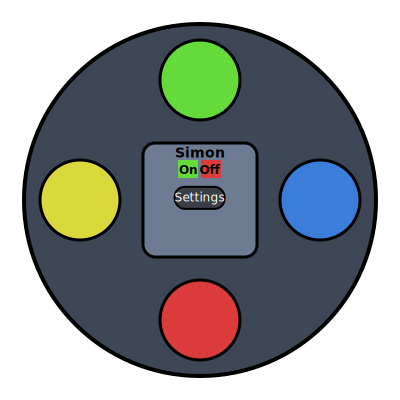
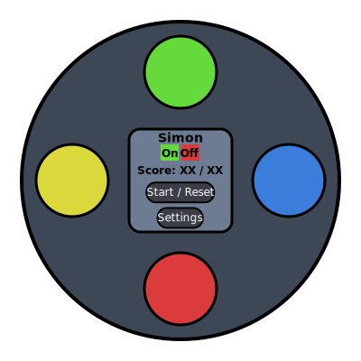
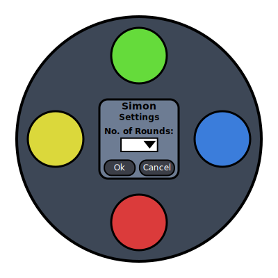

# Simon Game - By Scott Wilson
Simon is an electronic memory game, where the player has to recite the pattern randomly generated by the game. This project is my recreation of the game playable within a browser. This game will also my Stream 2 Project for the Full Stack Developer Course that I am currently studying at the Code Institute.

## Project Link
*A Fully Functional Game can be found at the below link:*

[https://scott00sw.github.io/stream_2_project/](https://scott00sw.github.io/stream_2_project/)

## UX
My project is be based on a few examples that I have found on Code Pen. I have taken what I believe to be the best aspects of each of the three games interfaces, and have worked these into my design.

## Wireframes
### Main Screen


### Game Screen


### Settings Screen


## Features
This game will allows the user to set the game length that they wish to play. User can select from 5, 10, 15, or 20 moves per game. This can be set within the settings screen of the game by clicking the settings button.

### Technologies Used
#### HTML
The project uses **HTML** for the games structure. This is essentially the foundation of this project.

#### CSS3
The project uses **CSS** to enhance the appearance of the HTML elements. CSS used in this project is mainly responsible for setting the visual aspects of this game.

#### Javascript
The project uses **Javascript** for the computation logic, and serves to handle the vast majority of the computational logic required to make this game possible.

#### JQuery
The project uses **JQuery** to simplify DOM manipulation, and make the game more interactive.

#### SVG
The project uses **SVG** for creating the Wireframes and for designing the project's GUI.

## Testing
### HTML & CSS Validation Checks
#### HTML
https://validator.w3.org/nu/?doc=https%3A%2F%2Fscott00sw.github.io%2Fstream_2_project%2Findex.html
##### Result
    Document checking completed. No errors or warnings to show.

    Used the HTML parser. Externally specified character encoding was utf-8.

    Total execution time 97 milliseconds.

#### CSS
https://validator.w3.org/nu/?doc=https%3A%2F%2Fscott00sw.github.io%2Fstream_2_project%2Fcss%2Fstyle.css
##### Result
    Document checking completed. No errors or warnings to show.

    Total execution time 123 milliseconds.


### Javascript Testing
I conducted my own user testing and debugging throughout the projects creation, to test that all the mark-up and code works as intended. These test outcomes are visible in the browser's console and each message is outputted to the console when a particular event occurs. I have listed each of the console outputs below alongside line numbers.

#### Line 40 - Confirms a game has been stared:
```
    console.log("Game Started");
```

#### Line 52 - Confirms a game has been ended:
```
    console.log("Game Ended");
```

#### Line 64 - Confirms the current round out of the total rounds (Message is repeated when a new round is started, or when a sequence is being replayed):
```
    console.log("Round " + simon.level + " of " + simon.rounds);
```

#### Line 73 - Outputs the current game sequence (Repeats for all generated game sequences):
```
    console.log("Game Sequence: " + simon.id + " " + simon.color);
```

#### Line 85 - Outputs the which button the user clicked + colour:
```
    console.log("User clicked: " + simon.id + " " +simon.color);
```

#### Line 101 - Confirms the game is moving to the next round:
```
    console.log("Next round");
```

#### Line 107 - Confirms the game has been won:
```
    console.log("You've Won!!);
```

#### Line 131 - Confirms an incorrect sequence has been inputted by the user:
```
    console.log("Incorrect Sequence");
```

#### Line 157 - Message outputted when the user changes the number of game rounds:
```
    console.log("Rounds changed to: " + simon.rounds);
```

#### Line 168 - Confirms settings screen has been opened:
```
    console.log("Settings Opened");
```

#### Line 183 - Confirms settings screen has been closed:
```
    console.log("Settings Closed");
```

#### Line 203 - Confirms the games power has been switched off:
```
    console.log("Power Switched Off");
```

#### Line 231 - Confirms the games power has been switched on:
```
    console.log("Power Switched On");
```

#### Line 272 - Confirms settings confirmation screen has been opened:
```
    console.log("Confirmation Screen Opened");
```

#### Line 293 - Confirms settings confirmation screen has been closed:
```
    console.log("Confirmation Screen Closed");
```

## Deployment
This game has been deployed to GitHub.

## Credits
I would like to thank Ben Blood, mrkaluzny & Geoge Louis's for sharing their versions of the game over at Code Pen. All three examples have greatly helped me to develop my version of the game. Links to each version of the games below:

Ben Blood's Simon Game: [https://codepen.io/BenLBlood/pen/LGLEoJ](https://codepen.io/BenLBlood/pen/LGLEoJ)

mrkalunzy's Simon Game: [https://codepen.io/mrkaluzny/pen/pbVxxd](https://codepen.io/mrkaluzny/pen/pbVxxd)

George Louise's Game: [https://codepen.io/zentech/pen/XaYygR)](https://codepen.io/zentech/pen/XaYygR)

I would also like to thank my course mentor Nishant Kumar for his advice and guidance.
